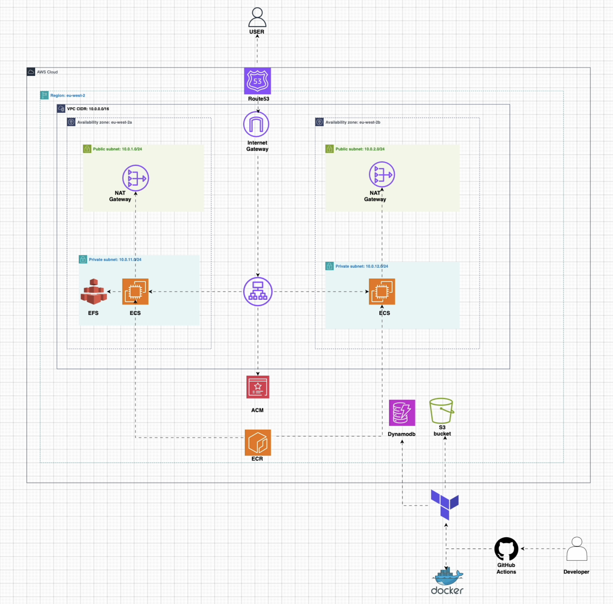
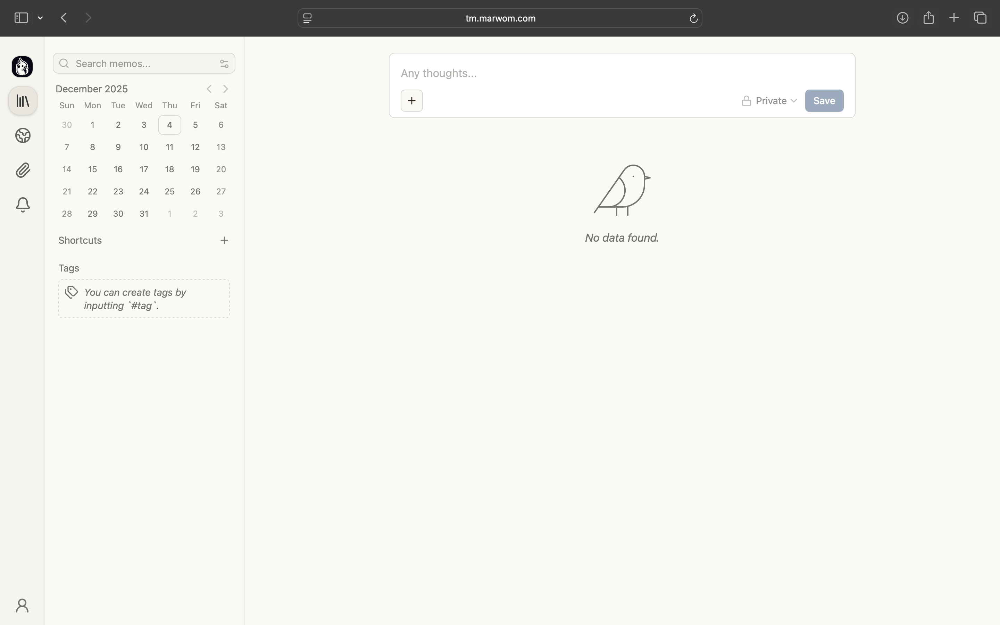
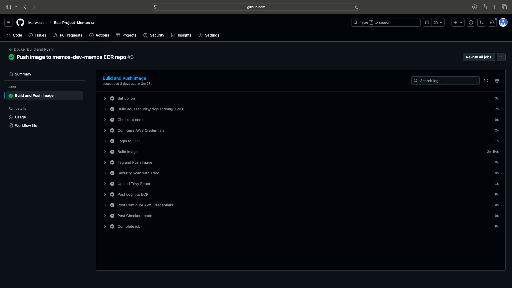
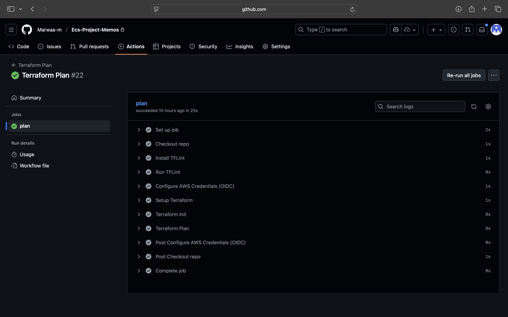
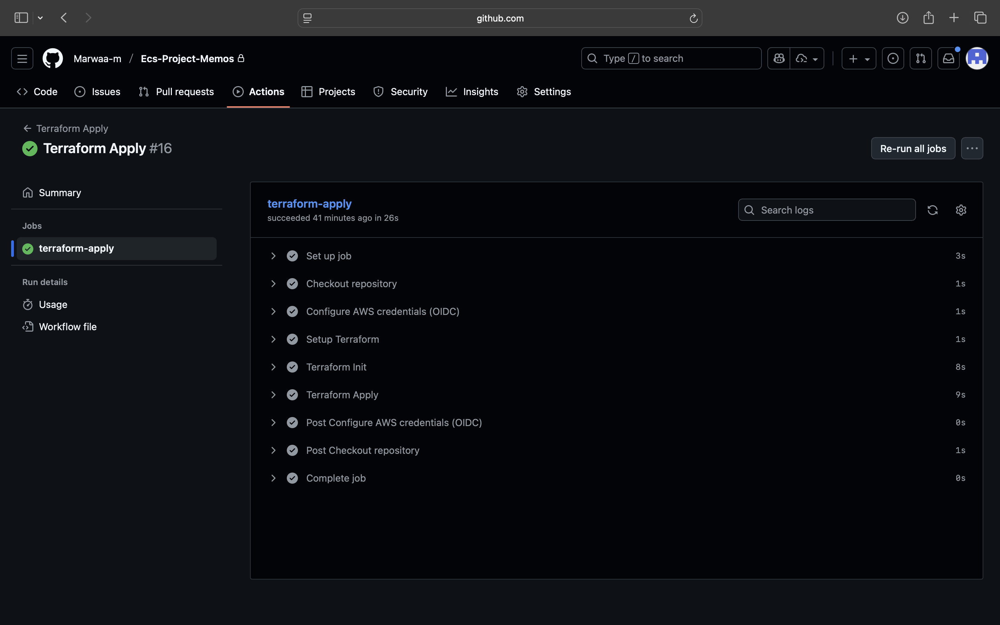

# MEMOS ECS Deployment on AWS ECS Fargate


This project provides a production-ready deployment of the Memos application on AWS ECS Fargate,provisioned using Terraform and deployed through GitHub Actions.
The setup includes a multi-AZ VPC, secure HTTPS routing, scalable ECS tasks, persistent EFS storage, ACM-managed certificates, and automated CI/CD pipelines.

---

## Table of Contents

- [Architecture Diagram](#architecture-diagram)
- [features](#features)
- [folder Structure](#folder-structure)
- [Run Locally](#run-locally)
- [Deploying to AWS](#deploying-to-aws)
- [Reproducing the Setup](#reproducing-the-setup)
- [Deployment Visuals](#deployment-visuals)
---
## Architecture Diagram




---

## Features

- Production-ready deployment of the Memos application on AWS
- Multi-AZ architecture for high availability and resilience
- HTTPS by default using ACM-managed certificates
- Application Load Balancer routing traffic to ECS Fargate tasks
- Private subnets with NAT gateways for secure outbound traffic
- Persistent data storage through Amazon EFS
- Automated CI/CD pipelines handling image builds and infrastructure updates
- Fully modular Terraform code, easy to extend and reuse
- Domain and DNS management through Route 53


---

## Folder Structure

```text
.
├── .github/
│   └── workflows/
│       ├── docker-build.yml
│       ├── tf-plan.yml
│       ├── tf-apply.yml
│       └── tf-destroy.yml
│
├── app/
│   └── Dockerfile
│
├── terraform/
│   ├── modules/
│   │   ├── acm
│   │   ├── alb
│   │   ├── ecr
│   │   ├── ecs
│   │   ├── efs
│   │   ├── route53
│   │   ├── sg
│   │   └── vpc
│   │
│   ├── backend.tf
│   ├── locals.tf
│   ├── main.tf
│   ├── outputs.tf
│   ├── providers.tf
│   ├── terraform.tfvars
│   └── variables.tf
│
├── images/
└── README.md


```

## Run Locally

### Requirements

- Docker
- Terraform 1.5 or later
- AWS CLI configured with valid credentials

### Running Memos Locally

The `app/` directory contains the Dockerfile used for local development and CI builds.

```bash
docker build -t memos-local ./app

docker run -p 5230:5230 memos-local
```


### Visit:
```
http://localhost:5230
```


---

### Deploying to AWS
### 1. Configure Terraform variables
All environment-specific values can be adjusted in:
```
terraform/terraform.tfvars
```
Update this file to match your AWS region, domain, and application settings.
---


### 2. Initialize and Deploy
From the terraform/ directory:
```
terraform init
terraform plan
terraform apply
```
---

### 3. Build and Push Docker Image
```
aws ecr get-login-password --region eu-west-2 \
  | docker login --username AWS --password-stdin <ECR_REPO_URL>

docker build -t memos .
docker tag memos:latest <ECR_REPO_URL>:latest
docker push <ECR_REPO_URL>:latest
```
---

### 4. CI/CD Workflows
Pushing to the main branch triggers workflows in:
```
.github/workflows/
```
### Workflows include:

Docker image build & push

Terraform plan

Terraform apply

---

### Reproducing the Setup
1. Clone the repository.

2. Configure Route 53 and ACM for your chosen domain.

3. Update terraform.tfvars with your environment settings.

4. Push changes to GitHub to trigger CI/CD workflows.

5. Wait for ECS tasks and the load balancer to stabilise.

6. Access the deployed Memos application via your domain.

---
## Deployment Visuals

### Memos Application Running


### Docker Build & Push


### Terraform Plan


### Terraform Apply

